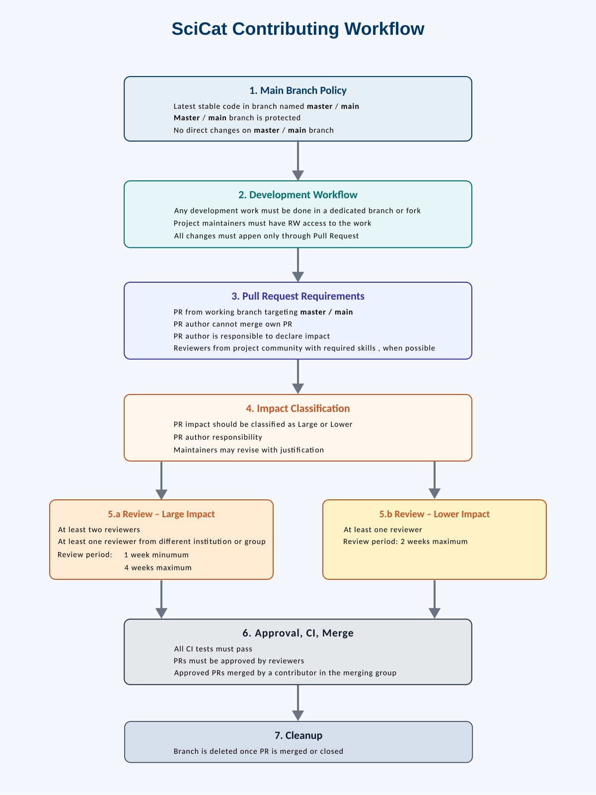

# Contributing to SciCat Projects

## Abbreviations and Links

Core = [SciCat Core](../project-components/SCICAT-CORE.md)

## Description

Core repositories follows the procedure indicated below for contributions.

Other SciCat repositories (Supported Projects and Non-Code repositories) are highly encouraged to follow the same procedure. If they decide otherwise, they should clearly state the contribution procedure in the CONTRIBUTING.md files included in the root folder of the repository.  
Each repository should also indicate who are the maintainers of the repository and list them, together with their responsibility, in the MAINTAINERS.md file.

## Merge Permissions

Each repository should have a merging group indicating who has merge permissions.  
The SciCat project leaders and the project leaders are automatically part of the project merge group.  
Other contributors can be part of the merge group. A contributor shall submit a dedicated request in order to be added to such group.  
Membership to the merge group is managed by the project leaders.  

The SciCat core repositories are managed as a single project. They have a single maintainers group and a single merge group.

## SciCat Contributing Workflow

### 1. Main Branch Policy

* The latest stable version of the code **must reside in `master` or `main`**.
* The `master` / `main` branch **is protected** and **must not be modified directly**.

### 2. Development Workflow

* All work (new features, bug fixes, documentation, or other changes) **must be done in a dedicated branch or a repository fork** depending on the user access.
* Dedicated forks **must allow read and write access for maintainers**.
* No changes may be introduced in `main` / `master` without a **Pull Request (PR)**.

### 3. Pull Request Requirements

* Every change **must be submitted via a Pull Request** targeting `master` / `main`.
* The **author of a Pull Request must not merge their own PR**.
* The author of a Pull Request must indicate the impact of the changes
* Reviews should be requested from official project reviewers, and The wider community when appropriate.
* When possible, reviewers should have the required skills to provide an unbiased and expert feedback.

### 4. Impact Classification

* Each Pull Request **must be classified by its impact**: _large_ or _lower_.
* **Responsibility for impact classification lies with the author**
* Repository maintainers can review and change the Pull Request impact.
* The impact classification **may be updated after submission**, provided:
  * A valid justification is given, and
  * The change is publicly documented in the PR.

### 5. Review Rules

#### Large-Impact Pull Requests

* Must be reviewed by **at least two maintainers**.
* At least **one reviewer must be from a different institution or group**.
* Review period: **minimum 1 week, maximum 2 weeks**.

#### Lower-Impact Pull Requests

* Must be reviewed by **at least one maintainer**.
* Review period: **maximum 2 weeks**.

### 6. Approval, CI, and Merge

* A Pull Request **must be approved** and **pass all CI checks** before it can be merged.
* **Only maintainers with the “Pull Request Master” role** may merge approved Pull Requests.

### 7. Branch Cleanup

* The source branch **must be deleted** once the Pull Request is merged or closed.

---
Licensed under the [CC BY-SA 4.0](https://creativecommons.org/licenses/by-sa/4.0/) License.
